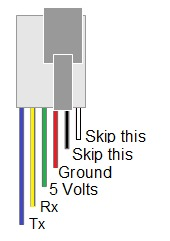

# LEGO EV3 Color Sensor Adapter for Arduino

Disclaimer: LEGO® and Powered UP are trademarks of the LEGO Group of companies which does not sponsor, authorize or endorse this project.

This project implements an adaptation of the [LEGO EV3](https://education.lego.com/en-us/product-resources/mindstorms-ev3/downloads/developer-kits#ev3-hardware-developer-kit)  Color Sensor for [Arduino](https://docs.arduino.cc/?_gl=1*1kv9ahn*_ga*MTI4Mjk2NTczNi4xNjg4Njg2NDE4*_ga_NEXN8H46L5*MTY4OTE4NzIzMy4zLjEuMTY4OTE4NzI0NC4wLjAuMA..) using serial communication. The code provided allows you to interface with the EV3 Color Sensor and read color values using an Arduino board.


## Prerequisites

To use this code and adapt the LEGO EV3 Color Sensor for Arduino, you will need the following:

- Arduino board (compatible with SoftwareSerial library)
- LEGO EV3 Color Sensor

## Connection of LEGO EV3 Color Sensor with Arduino

The LEGO EV3 Color Sensor can be adapted for use with Arduino using UART serial communication. The connection of the sensor wires with Arduino is as follows:

- Wire 6 (blue) of the sensor represents the TX (Transmit) pin and should be connected to the RX (Receive) pin of Arduino.
- Wire 5 (yellow) of the sensor represents the RX (Receive) pin and should be connected to the TX (Transmit) pin of Arduino.

This connection enables bidirectional communication between the color sensor and Arduino through the serial port. The TX pin sends data from the sensor to Arduino, while the RX pin receives data from Arduino.

Make sure to verify the specific pinout of your Arduino and connect it correctly to the corresponding pins of the LEGO EV3 Color Sensor.

The illustration below depicts the connection of wires from the LEGO EV3 Color Sensor to Arduino:




## Installation

Follow these steps to set up the project:

* Open your Arduino IDE and create a new sketch.

* Download the Ev3ColorSensor library files (Ev3ColorSensor.h and Ev3ColorSensor.cpp) and place them in your Arduino libraries directory.

* Include the Ev3ColorSensor library by adding the following line at the top of your sketch:

    ```c++
    #include "Ev3ColorSensor.h"
    ```

    
## Usage

The Ev3ColorSensor class provides the following methods:

* begin(): Initializes the sensor communication.
* read(): Reads the color value from the sensor and returns an integer representing the color detected.
* setMode(uint8_t newMode): Sets the mode of the color sensor. The available modes are RED_LIGHT (0), BLUE_LIGHT (1), COLOR (2), and OFF (5). Use the appropriate constant when calling this method.

## Example

Here's an example of how to use the Ev3ColorSensor library in your Arduino sketch:

```c++
#include "Ev3ColorSensor.h"

Ev3ColorSensor sensor(8, 7);

// Colors table from the sensor
String tableColor[8] = {
  "No color",
  "Black",
  "Blue",
  "Green",
  "Yellow",
  "Red",
  "White",
  "Brown",
};

void setup() {
  Serial.begin(9600);
  sensor.begin();
}

void loop() {
  uint8_t color = sensor.read();
  Serial.println(tableColor[color]);
}

```

This example sets up the sensor, initializes the serial communication, and continuously reads the color value from the sensor, printing the corresponding color name to the Serial Monitor.

## References

The development of this project was based on the following official documentation and external projects:

- Official LEGO Mindstorms EV3 Documentation: [LEGO Mindstorms EV3 Developer Kits](https://education.lego.com/en-us/product-resources/mindstorms-ev3/downloads/developer-kits#ev3-hardware-developer-kit)

- Arduino Documentation: [Arduino Official Documentation](https://docs.arduino.cc/)

- Hackaday.io Project: [Using LEGO EV3 Sensors with Arduino](https://hackaday.io/project/173770-use-lego-ev3-sensors-with-arduino)

We highly recommend referring to these resources for in-depth information and guidance on the LEGO Mindstorms EV3 system and Arduino.

Additionally, for detailed technical specifications and insights, the following PDF documents from LEGO Mindstorms can be found in the `docs` folder of this repository:

- [LEGO Mindstorms EV3 Hardware Developer Kit](./docs/lego-mindstorms-ev3-hardware-developer-kit.pdf)
- [LEGO Mindstorms EV3 Sensor and Motor Compatibility Chart](./docs/lego-mindstorms-ev3-color-sensor-hardware-schematics.pdf)

Feel free to explore these PDFs for additional information about the LEGO Mindstorms EV3 system.

## Author

- [@TonyALima](https://github.com/TonyALima)

## License

This project is under the license [MIT](./LICENSE).


